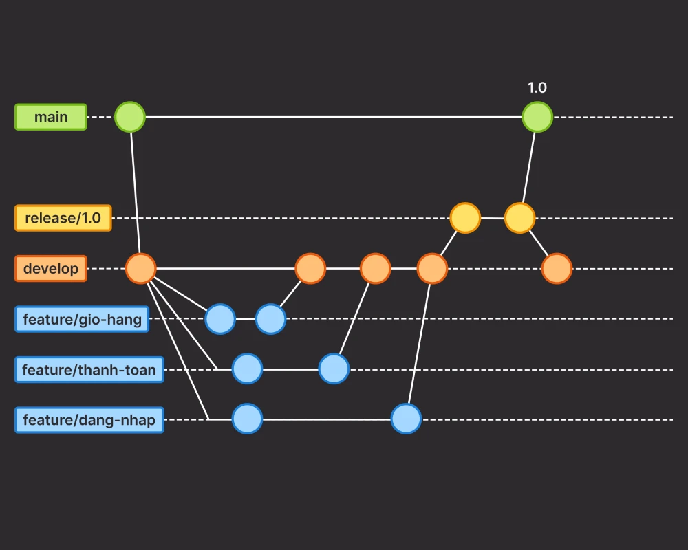
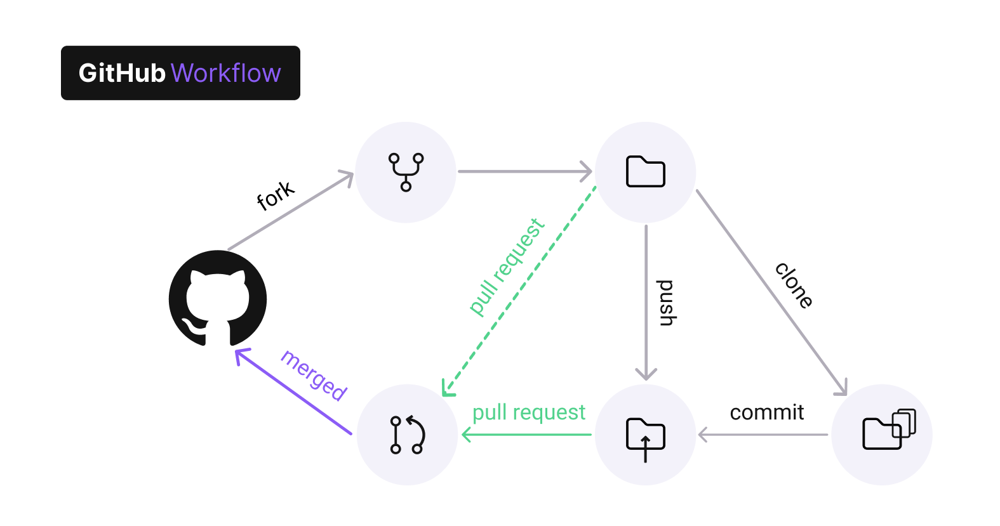
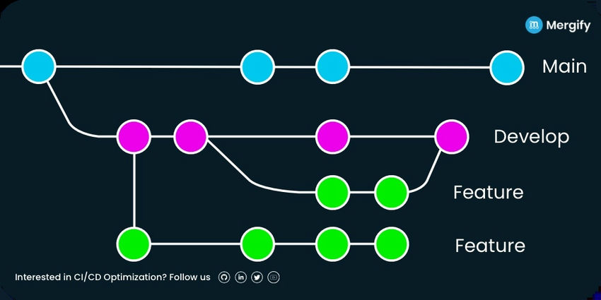
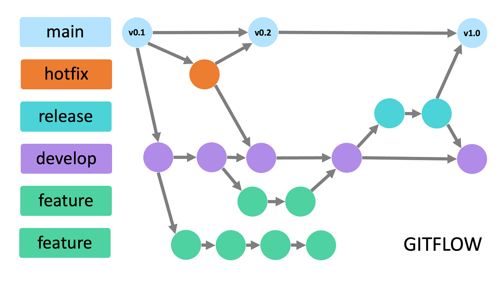

# 📘 Guía Definitiva de Git & GitHub

Bienvenido a tu referencia rápida y completa sobre **Git** y **GitHub**.  
Aquí encontrarás comandos esenciales, flujos de trabajo recomendados y buenas prácticas para que puedas trabajar de forma eficiente en tus proyectos de desarrollo, tanto de manera individual como en equipo.

Esta guía está pensada para:
- Recordar comandos y su sintaxis correcta.
- Entender para qué sirve cada uno.
- Aplicarlos de forma eficaz en entornos reales.

---

## 📁 Índice

1. [Introducción a Git](#1-introducción-a-git)  
2. [Configuración inicial](#2-configuración-inicial)  
3. [Comandos básicos](#3-comandos-básicos)  
4. [Trabajando con ramas](#4-trabajando-con-ramas)  
5. [Stash: guardado temporal](#5-stash-guardado-temporal)  
6. [Git log & reflog](#6-git-log--reflog)  
7. [Ignorar archivos (.gitignore)](#7-ignorar-archivos-gitignore)  
8. [Repositorios remotos (GitHub)](#8-repositorios-remotos-github)  
9. [Fork vs Clone](#9-fork-vs-clone)  
10. [Pull requests](#10-pull-requests)  
11. [Merge y resolución de conflictos](#11-merge-y-resolución-de-conflictos)  
12. [Workflows en Git](#12-workflows-en-git)  
13. [Buenas prácticas](#13-buenas-prácticas)  
14. [Recursos recomendados](#14-recursos-recomendados)

---

## 1. Introducción a Git

**Git** es un **sistema de control de versiones distribuido**.  
Permite registrar, comparar y revertir cambios en el código a lo largo del tiempo, trabajar en paralelo con diferentes ramas y colaborar con múltiples personas sin perder historial.

**GitHub** es una plataforma que usa Git como base, ofreciendo:
- Almacenamiento remoto de repositorios.
- Herramientas para colaboración y revisión de código.
- Integraciones con sistemas de CI/CD, gestión de proyectos y documentación.

💡 **Dato**: Git fue creado en 2005 por Linus Torvalds (creador de Linux) para gestionar el desarrollo del kernel de Linux.

---

## 2. 📦 Configuración inicial

Antes de empezar a trabajar con Git, es importante configurar tu identidad y algunas preferencias para que todos tus commits tengan la información correcta.

### Configurar nombre y correo globalmente

```bash
git config --global user.name "Tu Nombre"
git config --global user.email "tu@email.com"
```
💡 Tip: Si trabajas en varios proyectos con identidades diferentes (por ejemplo, personal y laboral), puedes omitir --global y configurar estos valores por repositorio.

### Definir rama principal por defecto

Desde 2020, Git recomienda usar main como nombre por defecto de la rama principal:

```bash
git config --global init.defaultBranch main
```
Esto evita que Git cree una rama master cuando inicializas nuevos repositorios

### Ver configuraciones actuales

```bash
git config --list
```
Muestra todas las configuraciones aplicadas (globales, locales y de sistema)

### Personalizar colores en la terminal

Git permite personalizar los colores de salida para mejorar la legibilidad:

```bash
git config --global color.status.branch "yellow"
git config --global color.status.added "green"
git config --global color.status.untracked "red bold"
```
- 📌 Colores disponibles: black, red, green, yellow, blue, magenta, cyan, white
- 📌 Estilos: bold, dim, ul (subrayado), blink, reverse

### Editar configuración manualmente

Puedes abrir y editar el archivo de configuración global directamente:

```bash
git config --global --edit
```
Esto abrirá el archivo .gitconfig en tu editor de texto por defecto, permitiendo ajustes más rápidos.

---

## 3. ✅ Comandos básicos

Estos son los comandos esenciales para trabajar con Git en tu día a día.  
Se organizan por flujo lógico: **inicializar ➡️ añadir cambios ➡️ confirmar ➡️ revisar historial ➡️ revertir cambios**.

### 📂 Inicializar un repositorio

```bash
git init
```
Crea un repositorio local generando un directorio oculto .git que contiene la configuración e historial del proyecto.

### 📌 Estado del repositorio

```bash
git status
```
Muestra:

- Archivos modificados y no rastreados.
- Archivos en staging (listos para commit).
- Rama actual y posibles mensajes de advertencia.

### ➕ Añadir archivos al área de staging

```bash
git add archivo.ext    # agrega un archivo específico
git add .              # agrega todos los cambios (nuevos, modificados)
git add *.ext          # agrega todos los archivos con cierta extensión
git add -A             # agrega todos los cambios, incluyendo eliminados
git add -u             # agrega solo cambios de archivos modificados o eliminados
```

### 💾 Confirmar cambios (commit)

```bash
git commit -m "mensaje descriptivo"
git commit -m "Título" -m "Descripción detallada"
```
Guarda los cambios de staging en el historial del repositorio.

📝 Buenas prácticas de commits
- Título: máximo 50 caracteres, sin punto final.
- Verbo en imperativo: Add, Fix, Remove, etc.
- Descripción: explicar el qué y el por qué.
- Formato: dejar una línea en blanco entre título y descripción.

📐 Commits convencionales

```txt
<tipo>(opcional:scope): descripción
```
Ejemplos:

- feat(login): add validation
- fix(api): handle error response

Tipos comunes:
feat, fix, refactor, docs, style, test, chore, build, ci, env

### ⚡ Atajo: agregar y commitear en un solo paso

```bash
git commit -am "mensaje"
```
Nota: Solo funciona con archivos ya rastreados.

### 📜 Ver historial

```bash
git log
```
Muestra commits con hash, autor, fecha y mensaje.

```bash
git show [hash]
```
Detalles de un commit específico.

### 🔍 Ver diferencias

```bash
git diff              # cambios sin stage
git diff --staged     # cambios en stage
git diff rama1 rama2  # diferencias entre ramas
git diff commit1 commit2  # diferencias entre commits
```

Interpretación básica del diff:
```txt
--- archivo versión anterior
+++ archivo versión nueva
@@ -linea_antigua +linea_nueva @@
```

### ❌ Quitar cambios del área de staging

```bash
git reset archivo.ext
```
Devuelve el archivo al área de trabajo.

### ⏪ Revertir cambios y restaurar estados anteriores

```bash
git reset --soft [hash]   # conserva en staging
git reset [hash]          # mixed: conserva en área de trabajo
git reset --hard [hash]   # borra cambios posteriores           
```
```bash
git revert [hash]
```
Crea un commit que deshace los cambios de otro commit.

```bash
git checkout archivo.ext   # descarta cambios en un archivo
git checkout .             # descarta cambios en todo el repo
```

### 🛠 Reescritura avanzada del historial

```bash
git rebase main       # reubica commits sobre main
git rebase -i main    # rebase interactivo
git commit --amend    # modifica último commit
git cherry-pick [hash] # aplica un commit de otra rama
```
⚠ Advertencia: rebase, amend y cherry-pick reescriben el historial. Evítalos en ramas compartidas con otros desarrolladores.

### ✅ Resumen visual del flujo básico

```txt
[git init] → [git status] → [git add] → [git commit] → [git log]
```

---

## 4. 🔀 Trabajando con ramas

Las ramas en Git permiten desarrollar funcionalidades, corregir errores o experimentar sin afectar la rama principal (`main` o `master`).

### 📌 Crear una rama
```bash
git branch nombre-rama
```
Crea una nueva rama, pero no cambia a ella.

### 📌 Listar ramas

```bash
git branch
```
Muestra todas las ramas locales, resaltando con * la rama actual.

### 📌 Renombrar una rama

```bash
git branch -m nombre-antiguo nombre-nuevo
```
Renombra una rama local.

```bash
git branch -M main
```
Renombra forzadamente la rama actual a main (útil si se llamaba master).

### 📌 Cambiar de rama

```bash
git switch nombre-rama
```
```bash
git checkout nombre-rama
```
Mueve el HEAD a otra rama.

### 📌 Crear y cambiar a una rama

```bash
git switch -c nueva-rama
```
```bash
git checkout -b nombre-rama
```
Crea una nueva rama y cambia a ella en un solo paso.

### 📌 Eliminar una rama

```bash
git branch -d nombre-rama   # si ya fue fusionada
git branch -D nombre-rama   # forzar eliminación
```

### 📌 Ver grafo de ramas

```bash
git log --oneline --graph --all --decorate
```
Muestra un historial visual con todas las ramas y commits.

### 🌿 Convenciones para nombrar ramas
Usar nombres claros y descriptivos, preferentemente con un prefijo que indique el tipo de tarea:

- **feature/** → nueva funcionalidad
- **bugfix/** → corrección de errores
- **hotfix/** → solución urgente
- **release/** → preparación de versión
- **docs/** → cambios en documentación

Ejemplos:

- feature/45-add-navbar
- bugfix/fix-login-form
- release/v1.0.0

### 📊 Diagrama de flujo con ramas



---

## 5. 📂 Stash: guardado temporal

El **stash** en Git permite **guardar temporalmente cambios no confirmados** (en el área de trabajo o en staging) sin necesidad de hacer un commit, para poder cambiar de rama o realizar otras tareas sin perder el progreso.

### Guardar cambios no listos para commitear
```bash
git stash
```
Guarda todos los cambios no confirmados (archivos modificados y en staging) en una pila temporal y limpia el área de trabajo.

### Listar cambios guardados en stash

```bash
git stash list
```
Muestra una lista de todos los stashes, con índice y descripción. Ejemplo:

```txt
stash@{0}: WIP on main: 1a2b3c4 Añadida función de login
stash@{1}: WIP on feature/navbar: 5d6e7f8 Modificada barra de navegación
```

### Aplicar cambios guardados

```bash
git stash apply
```
Restaura el último stash pero no lo elimina de la lista.

### Eliminar un stash

```bash
git stash drop stash@{n}
```
Elimina un stash específico

### Aplicar y eliminar al mismo tiempo

```bash
git stash pop
git stash pop stash@{n}
```
Restaura los cambios y elimina el stash aplicado.

### Guardar cambios con nombre descriptivo

```bash
git stash save "mensaje"
```
Guarda cambios con un mensaje personalizado (en versiones recientes de Git, usar git stash push -m "mensaje").

### Incluir archivos nuevos sin seguimiento

```bash
git stash --include-untracked
```
Guarda también los archivos nuevos no seguidos (untracked) en el stash.

📌 Notas importantes

- El stash no se comparte con repositorios remotos, es local.

- Puedes usar git stash branch nombre-rama para crear una nueva rama con los cambios del stash.

- Ideal para cuando estás en medio de un cambio y surge una tarea urgente en otra rama.

---

## 6. 📜 Git log & reflog

Git ofrece varias formas de ver el historial de cambios y movimientos en un repositorio.

### Historial de commits
```bash
git log
```
Muestra:

- ID (hash) del commit
- Autor
- Fecha
- Mensaje del commit

Ejemplo:

```txt
commit 3a5b2f1e...
Author: Juan Pérez <juan@example.com>
Date:   Tue Aug 8 18:30:15 2023 -0300

    Añadida validación de formulario

```

### Versión resumida del historial

```bash
git log --oneline
```
Muestra cada commit en una sola línea:

```txt
3a5b2f1 Añadida validación de formulario
92bc1c0 Modificada estructura de carpetas
```

### Limitar el número de commits mostrados

```bash
git log -n <número>
```
Ejemplo:
```bash
git log -n 5
```
Muestra solo los últimos 5 commits

### Cambiar el formato de salida

```bash
git log --format=[short | medium | full]
```
- short → vista breve (solo autor y mensaje)

- medium → vista por defecto

- full → incluye más metadatos (autor, committer, fechas)

### Ver historial como grafo de ramas

```bash
git log --oneline --graph --all --decorate
```
Ideal para visualizar cómo se bifurcan y fusionan las ramas.

### 📌 git reflog: historial de movimientos de HEAD

```bash
git reflog
```
Muestra el registro de todos los cambios de referencia en HEAD, incluso si los commits fueron borrados o ya no están en el historial normal.

Ejemplo:
```txt
b1d2e3f HEAD@{0}: commit: Ajuste de estilos CSS
c4d5e6a HEAD@{1}: checkout: moving from main to feature/navbar
```

✅ Útil para:

- Recuperar commits eliminados
- Ver cuándo y cómo cambiaste de rama
- Diagnosticar problemas de referencia

### 📌 Consejo extra:
Puedes combinar git log con opciones de formato para crear vistas personalizadas:

```bash
git log --pretty=format:"%h - %an, %ar : %s"
```

- **%h** → hash corto
- **%an** → autor
- **%ar** → tiempo relativo
- **%s** → mensaje del commit

---

## 7. 🚫 Ignorar archivos (.gitignore)

El archivo **`.gitignore`** indica a Git qué archivos o carpetas **no deben ser rastreados ni incluidos** en los commits.  
Es especialmente útil para excluir:
- Dependencias instaladas (ej: `node_modules/`)
- Archivos de configuración local (ej: `.env`)
- Archivos generados automáticamente o temporales (ej: `.log`, `.zip`)

### 📄 Ejemplo de `.gitignore`
```gitignore
# Dependencias
node_modules/

# Archivos de configuración sensibles
.env

# Archivos de log
*.log

# Archivos comprimidos
*.zip
```

### 📍 Ubicación

El archivo debe estar en la raíz del repositorio:

```bash
/.gitignore
```

### 🛠️ Crear un .gitignore

Puedes crearlo manualmente:

```bash
touch .gitignore
```
O generar uno específico para tu lenguaje/tecnología desde [gitignore.io](https://www.toptal.com/developers/gitignore).

### 📌 Notas importantes

1. El .gitignore solo afecta a archivos no rastreados.
Si un archivo ya fue añadido con git add, seguirá siendo rastreado aunque lo incluyas en .gitignore.
Para dejar de rastrearlo:
    ```bash
    git rm --cached archivo
    ```
2. Puedes tener .gitignore global para todos tus repositorios:
    ```bash
    git config --global core.excludesfile ~/.gitignore_global
    ```
3. Admite patrones avanzados:
- ***.ext** → todos los archivos con cierta extensión
- **/carpeta/** → carpeta en la raíz
- ****/carpeta** → carpeta en cualquier subdirectorio
- **!archivo.txt** → excepción (incluir este archivo aunque coincida con otra regla)

### 📚 Recurso recomendado:

Lista completa de reglas y patrones en la [documentación oficial de Git](https://git-scm.com/docs/gitignore).


---

## 8. 🔗 Repositorios remotos (GitHub)

En Git, un **repositorio remoto** es una copia de tu proyecto almacenada en un servidor (como GitHub), que te permite sincronizar cambios con otros desarrolladores o entre tus propios dispositivos.

### 📌 Vincular repositorio local con GitHub

Si tu repositorio ya está creado en GitHub y quieres enlazarlo con tu carpeta local:

```bash
git remote add origin git@github.com:usuario/repositorio.git
```
💡 Consejo: Usa la URL SSH (git@github.com:...) si ya configuraste tu clave SSH.
Si no, también puedes usar la URL HTTPS (https://github.com/usuario/repositorio.git).

### 🔍 Ver repositorios remotos vinculados

```bash
git remote -v
```
Muestra las direcciones de los repositorios remotos asociados a tu proyecto. Ejemplo de salida:
```bash
origin  git@github.com:usuario/repositorio.git (fetch)
origin  git@github.com:usuario/repositorio.git (push)
upstream  git@github.com:usuario/repositorio.git (fetch)
upstream  git@github.com:usuario/repositorio.git (push)
```

### 🚀 Enviar cambios al repositorio remoto

#### Primer push (configurando seguimiento de rama):

```bash
git push -u origin main
```
La opción -u (o --set-upstream) establece un vínculo entre tu rama local y la rama remota, permitiendo que en adelante solo uses git push o git pull sin parámetros.

#### Push en envíos posteriores:

```bash
git push 
```
Sube los cambios desde la rama local actual a su rama remota asociada.

#### Enviar una rama específica:

```bash
git push origin nombre-rama
```

### 📥 Actualizar el repositorio local desde el remoto

```bash
git pull 
```
Descarga y fusiona cambios del repositorio remoto a tu rama local actual.

🔹 Recomendación: Ejecuta git pull antes de comenzar a trabajar para asegurarte de que tienes la última versión del código, especialmente en proyectos colaborativos.

### 🗒 Resumen visual


---

## 9. 🍴 Fork vs Clone

En Git y GitHub, **Fork** y **Clone** no son lo mismo, aunque ambos implican copiar un repositorio.

| Concepto  | Fork (GitHub)                          | Clone (Git)                                  |
|-----------|----------------------------------------|----------------------------------------------|
| Qué hace  | Crea una copia en **tu cuenta de GitHub** | Crea una copia **local** en tu equipo       |
| Permisos  | Tienes control total (puedes hacer push a tu fork) | Solo puedes hacer push si eres colaborador del repositorio original |
| Uso común | Contribuir a proyectos públicos de otros | Trabajar con tu propio repositorio o con acceso de colaborador |

### 🔐 Consideraciones de licencia
Un **fork** solo es posible si el repositorio original tiene una licencia que lo permita (por ejemplo, MIT, Apache 2.0, GPL).

### 🌿 Buenas prácticas al hacer un fork
1. **Haz el fork en GitHub** desde la página del repositorio original.
2. **Clona tu fork** a tu equipo:
   ```bash
    git clone git@github.com:tu-usuario/tu-fork.git
    ```
3. Agrega el remoto upstream (el repositorio original):
    ```bash
    git remote add upstream git@github.com:usuario/repositorio-original.git
    ```
4. Trabaja en ramas secundarias (feature/, bugfix/, etc.), no directamente en main.
5. Sincroniza tu fork periódicamente:
    ```bash
    git remote add upstream git@github.com:usuario/repositorio-original.git
    ```

### 📥 Clonar un repositorio (clone)

El comando git clone descarga una copia local de un repositorio remoto:

```bash
git clone https://github.com/usuario/repositorio.git
```
Esto crea una carpeta con todo el historial y enlaza el repositorio remoto bajo el nombre origin.

Clon superficial (shallow clone):
```bash
git clone --depth 1 https://github.com/usuario/repositorio.git
```
Solo descarga el último commit, útil para proyectos muy grandes donde no necesitas el historial completo.

### 🔄 Sincronizar un fork con el original (upstream)

Si has hecho un fork y quieres mantenerlo actualizado:

1. Agregar remoto original (upstream):
    ```bash
    git remote add upstream git@github.com:usuario/repositorio-original.git
    ```
2. Verificar remotos:
    ```bash
    git remote -v
    ```
3. Actualizar tu rama main con cambios del original:
    ```bash
    git fetch upstream
    git pull upstream main
    ```

### 🗒 Resumen visual



---

## 10. 🔁 Pull Requests (PR)

Una **Pull Request (PR)** es una solicitud para que tus cambios (hechos en una rama) sean revisados y, si se aprueban, fusionados en otra rama (normalmente `main` o `develop`) de un repositorio remoto.

### 📌 Tipos de Pull Requests

- **Pull Request estándar:** cambios listos para revisión.
- **Draft Pull Request (borrador):** cambios aún en desarrollo, se usa para recibir retroalimentación temprana.

### 💡 Buenas prácticas para PRs efectivas

- Haz **PRs pequeñas y enfocadas** para que sean fáciles de revisar.
- Escribe un **título descriptivo** y un **mensaje claro** explicando:
    - Qué problema resuelve.
    - Qué cambios se hicieron.
    - Si rompe o modifica alguna funcionalidad existente.
- Incluye **capturas de pantalla** o **GIFs** si el cambio afecta la interfaz.
- **No mezcles cambios de distinta naturaleza** en la misma PR.
- Actualiza tu rama antes de abrir la PR para evitar conflictos:
    ```bash
    git fetch upstream
    git pull upstream main
    ```

### 🛠️ Pasos para crear una Pull Request

1. Clonar el repositorio (o trabajar en el fork si no eres colaborador):
    ```bash
    git fetch upstream
    ```
2. Crear y cambiar a una rama nueva para tu cambio:
    ```bash
    git checkout -b feature/nueva-funcionalidad
    ```
3. Realizar cambios y confirmarlos:
    ```bash
    git add .
    git commit -m "feat: añadir nueva funcionalidad"
    ```
4. Enviar cambios al repositorio remoto:
    ```bash
    git push origin feature/nueva-funcionalidad
    ```
5. Abrir la Pull Request en GitHub:

    - Ir a la página del repositorio en GitHub.
    - Hacer clic en "Compare & pull request".
    - Escribir título, descripción y seleccionar la rama de destino.

### 🔄 Actualizar una PR abierta

Si el autor de la PR necesita hacer cambios adicionales:
```bash
# Asegurarse de estar en la rama de la PR
git checkout feature/nueva-funcionalidad

# Hacer cambios y subirlos
git add .
git commit -m "fix: corregir errores"
git push origin feature/nueva-funcionalidad
```
Los nuevos commits se agregarán automáticamente a la PR existente.

### 🗒 Resumen visual


---

## 11. 🔁 Merge y resolución de conflictos

En Git, un **merge** es la acción de fusionar los cambios de una rama en otra.  
En equipos, esto suele generar **conflictos** si dos personas modifican las mismas líneas o archivos de manera incompatible.

### ⚠️ ¿Qué es un conflicto de merge?

Ocurre cuando Git **no puede decidir automáticamente** qué cambios conservar.  
En ese caso, Git marca el archivo con separadores:

```txt
<<<<<<< HEAD
código actual (rama donde estás)
=======
código entrante (rama que intentas fusionar)
>>>>>>> nombre-rama
```

- **HEAD** → tu rama actual.
- **nombre-rama** → la rama que intentas fusionar

### 🛠️ Resolver conflictos

1. Elegir los cambios a conservar:
    ```bash
    git checkout --ours archivo.ext    # Mantener cambios de la rama actual
    git checkout --theirs archivo.ext  # Mantener cambios de la rama que fusionas
    ```
2. O editar manualmente el archivo para combinar lo mejor de ambos cambios.
3. Marcar como resuelto y confirmar:
    ```bash
    git add archivo.ext
    git commit   # Sin mensaje → Git lo genera automáticamente
    ```

💡 Consejo: Usa un editor con soporte para resolución de conflictos como VS Code, Sublime Merge o GitKraken para hacerlo más visual.

### ✅ Buenas prácticas para evitar conflictos

- Haz commits pequeños y frecuentes.
- Escribe mensajes de commit claros y descriptivos.
- Mantén actualizado tu repositorio local:
    ```bash
    git fetch origin
    git pull origin main
    ```
- Trabaja en ramas propias y sincronízalas con frecuencia.

### 🔄 Comando básico para fusionar ramas

```bash
git merge nombre-rama
```
Debes estar posicionado en la rama que recibirá los cambios. Ejemplo:
```bash
git checkout main
git merge feature/nueva-funcionalidad
```
Esto fusiona feature/nueva-funcionalidad dentro de main.

### 📂 Estrategias de merge

1. Fast-forward merge (por defecto)

    - No se crea commit nuevo.
    - El apuntador de la rama avanza directamente.
    ```bash
    git merge nombre-rama
    ```

2. Merge commit

    - Se crea un commit adicional para registrar la fusión.
    - Útil si las ramas han avanzado de forma independiente.
    ```bash
    git merge --no-ff nombre-rama
    ```

3. Squash merge

    - Combina todos los commits de una rama en uno solo.
    - Útil para limpiar el historial antes de integrar.
    ```bash
    git merge --squash nombre-rama
    git commit -m "feat: integrar cambios de nombre-rama en un solo commit"
    ```

---

## 12. 🔄 Workflows en Git

Un **workflow** en Git es la forma en la que organizamos ramas y colaboramos dentro de un proyecto.  
Elegir un buen flujo de trabajo mejora la **colaboración**, **calidad del código** y **velocidad de entrega**.

### 🚀 Feature-Based Workflow

📌 **Idea principal:**  
Cada funcionalidad o cambio se desarrolla en una **rama independiente** a partir de la principal (`main` o `develop`).

**Proceso:**
1. Crear una rama para la nueva funcionalidad:
   ```bash
   git checkout -b feature/nueva-funcionalidad
   ```
2. Hacer commits con los cambios.
3. Hacer push de la rama y abrir una Pull Request.
4. Revisar y fusionar con la rama principal.

**Ventajas:**
- Aísla el desarrollo de cada funcionalidad.
- Facilita la revisión de código.
- Compatible con la mayoría de los proyectos.

**Diagrama simplificado:**



### 🏗️ Git Flow

📌 **Idea principal:** 
Separar desarrollo, lanzamientos y correcciones mediante varias ramas con roles definidos.
Muy usado en equipos grandes y proyectos con ciclos de entrega largos.

**Ramas principales:**
- main → código estable listo para producción.
- develop → versión en desarrollo.

**Ramas de soporte:**
- feature/* → nuevas funcionalidades (desde develop y hacia develop).
- release/* → preparación de versiones (desde develop hacia main).
- hotfix/* → correcciones urgentes (desde main hacia main y develop).

**Ventajas:**
- Organización clara.
- Ideal para proyectos con múltiples lanzamientos y varios desarrolladores.
- Facilita la gestión de versiones y hotfixes.

**Desventajas:**
- Puede ser complejo para proyectos pequeños.
- Requiere disciplina en la gestión de ramas.

**Diagrama simplificado:**



### 🌱 Trunk-Based Development

📌 **Idea principal:** 
Trabajar con una sola rama principal (main) y crear ramas muy cortas para cambios específicos.
Se integra rápidamente para evitar conflictos

**Proceso:**
1. Trabajar en ramas pequeñas (duración 1–2 días).
2. Integrar a main varias veces al día si es posible.
3. Usar feature flags para activar/desactivar funciones sin afectar producción.

**Ventajas:**
- Muy rápido y simple.
- Menos conflictos de merge.
- Ideal para entregas continuas y equipos ágiles.

**Diagrama simplificado:**


### 📌 ¿Qué workflow elegir?

|      Proyecto       |        Tamaño del equipo         |        Recomendado          |
|---------------------|----------------------------------|-----------------------------|
| Personal / Pequeño  | 1–3 personas                     | Feature-Based o Trunk-Based |
| Mediano (5–10)      | Ciclos de entrega de 2–4 semanas | Feature-Based               |
| Grande (10+)        | Varias versiones activas         | Git Flow                    |
| Ágil y rápido       | Equipos experimentados           | Trunk-Based                 |

---

## 13. ✅ Buenas prácticas en Git

Seguir buenas prácticas no solo mejora la calidad del código, sino que también facilita el trabajo en equipo y reduce errores.

- **Commits pequeños y descriptivos**
    - ❌ `git commit -m "cambios"`
    - ✅ `git commit -m "fix: corrige bug en validación de formulario"`
    - Ventaja: más fácil de revisar y revertir.

- **Usar ramas para nuevas funcionalidades**
    ```bash
    git checkout -b feature/login-usuario
    ```
    Así evitamos afectar main o develop antes de que el cambio esté listo.

- **Evitar git push -f (forzar push) en ramas compartidas**
    - Puede sobrescribir trabajo de otros.
    - Usar solo en ramas propias y con precaución.

- **Crear .gitignore desde el inicio**
    - Evita subir archivos innecesarios o sensibles.
    - Ejemplo:
    ```bash
    node_modules/
    .env
    *.log
    ```

- **Revisar git status antes de cada commit**
    ```bash
    git status
    ```
    Para confirmar qué se va a incluir en el commit.

- **Hacer git pull antes de git push**
    - Sincroniza la rama local con la remota.
    - Reduce el riesgo de conflictos de merge.

---

## 14. 📚 Recursos recomendados

- 📖 [Pro Git Book (en español)](https://git-scm.com/book/es/v2) — Manual oficial de Git, desde lo básico hasta temas avanzados.
- 📄 [GitHub Docs](https://docs.github.com/) — Documentación oficial de GitHub.
- 🎮 [Oh My Git! Juego para aprender Git](https://ohmygit.org/) — Juego interactivo para aprender Git de forma divertida.
- 🌱 [Learn Git Branching (interactivo)](https://learngitbranching.js.org/) — Herramienta visual para practicar comandos y flujos de trabajo en Git.

---

> ✨ Nota final: Esta guía está pensada como referencia rápida y recurso de consulta constante. Puedes adaptarla y ampliarla según tus necesidades y experiencia.
Un buen uso de Git te ahorrará tiempo, reducirá conflictos y mejorará la calidad de tus proyectos.